# Kubernetes

### Docs Link

https://kubernetes.io/

## Pod

the smallest unit of kubernetes.
it is an abstraction of docker container.
pod designed to run one app container inside it.

## Virtual network

Kubernetes provides a virtual network. each pod gets its own uniq internal IP address in the virtual network, and each pod can communicate with the other pods with this IP addresses

## ingress

make the IP address more readable like and you can add init the ssr security for https protocol
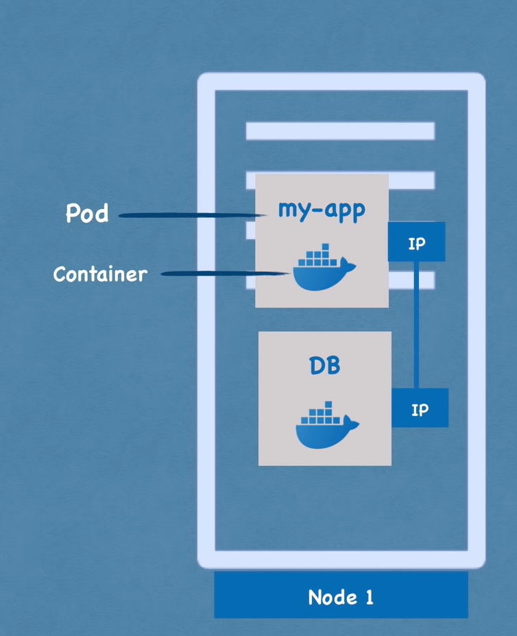

## service

A permanent IP address that can be address to each pod.
the lifecycle of the pods and services are not connected so even id a pod dies the service (IP address) will stay

## External service

Alow your app to be connect to the internet or other external sources.

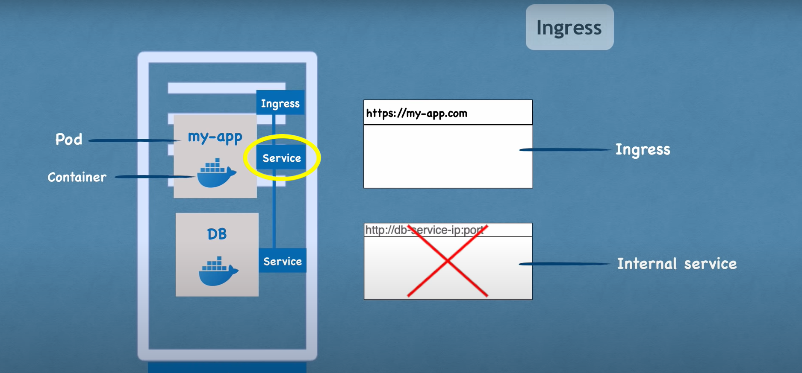

## configmap

external configuration of your app.
inside it will be environments variables.
you need to connect the config map to a pod

## secret

A file like config map but it use to restore secret data (like credentials) in base64 encoded format.
like the config map you connect the secret to a specific pod.

## Volumes

you as administrator need to menage the data.
By using volumes you can persist your data even if the database pod is shat down.
it attach a file/ folder to pod.

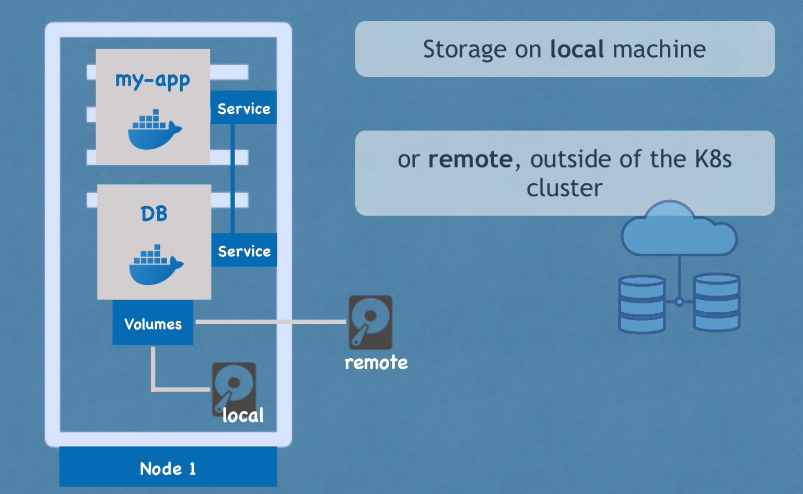

## Deployments

A blueprint of pods and
A Tool that manage your pods so if one dais it can up or redirect to another pod that do the same thing like the first one.

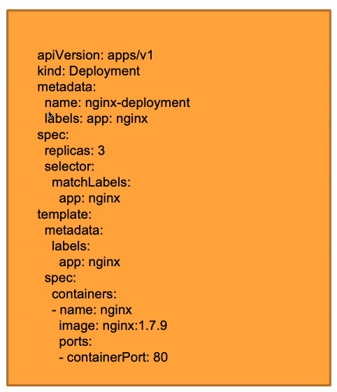

## StatefulSet

you can look at this as Deployment to database. it allow you to kill database pods and still have the data persistence

## architecture

### Nodes

cluster servers that the pods run on
3 processes must be installed on each node

1. the container runtime that is being manage by **Kubelet**
2. services - a load balance and the why to communicate between nodes
3. **kube proxy** - manage the nodes

### Master processes

control the cluster state and the worker nodes

1. **API service** - functioning as a cluster gateway and Authentication gateway
2. **Scheduler** - handle the reprocess on the nodes and decides on with node to run the pod
3. **controller manager** - detects cluster state changes and try to recover the cluster state as soon as possible
4. **atcd** - the cluster brain

## Basic kubectl commands

### get all the nodes that runs on the cluster

```
kubectl get nodes
```

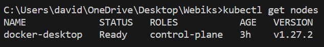

### get pos

```
kubectl get pod
```

### get services

```
kubectl get services
```

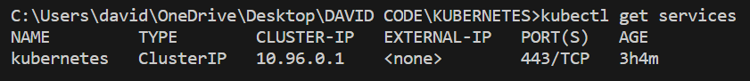

### create command

```
kubectl create -h
```

#### create deployment

example of creating and deploying nginx image

```
kubectl create deployment nginx-depl --image=nginx

kubectl get deployments

kubectl get pod

kubectl get replicaset
```

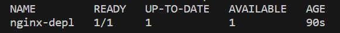
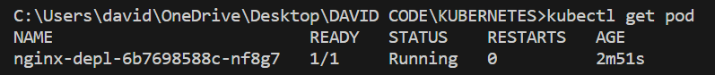

### Edit deployment

```
kubectl edit deployment nginx-depl
```

this command will open a text editor with yaml file of the deployment that you can edit. after you edit the file save and close it you will see the following message

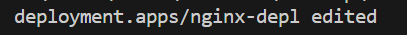

## Debugging pods

```
kubectl logs <Pod name>
```

example

```
kubectl create deployment mongodb-deployment --image=mongo

kubectl get pod

kubectl describe pod mongodb-deployment-684d4cdcdf-9786c

kubectl logs mongodb-deployment-684d4cdcdf-9786c
```

result

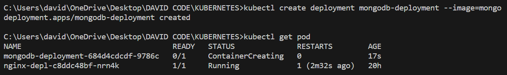
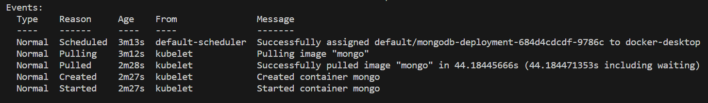

### Kubectl exec

opening a terminal inside the pod

```
kubectl exec -it <pod name> bash
```

example

```
kubectl exec -it mongodb-deployment-684d4cdcdf-9786c bash
```

## Delete pods

All the CRUD happening in the deployment level

```
kubectl get deployment

kubectl delete deployment <deployment name>

kubectl get deployment
```

## Apply command

Take a file and execute it

```
kubectl apply -f <file name>
```

- -f = file

### example

```
touch nginx-deployment.yaml
```

```
apiVersion: apps/v1
kind: Deployment
metadata:
  name: nginx-deployment
  labels:
    app: nginx
spec:
  replicas: 2
  selector:
    matchLabels:
      app: nginx
  template:
    metadata:
      labels:
        app: nginx
    spec:
      containers:
        - name: nginx
          image: nginx:1.16
          ports:
            - containerPort: 80

```

```
kubectl apply -f nginx-deployment.yaml

kubectl get pod
```
